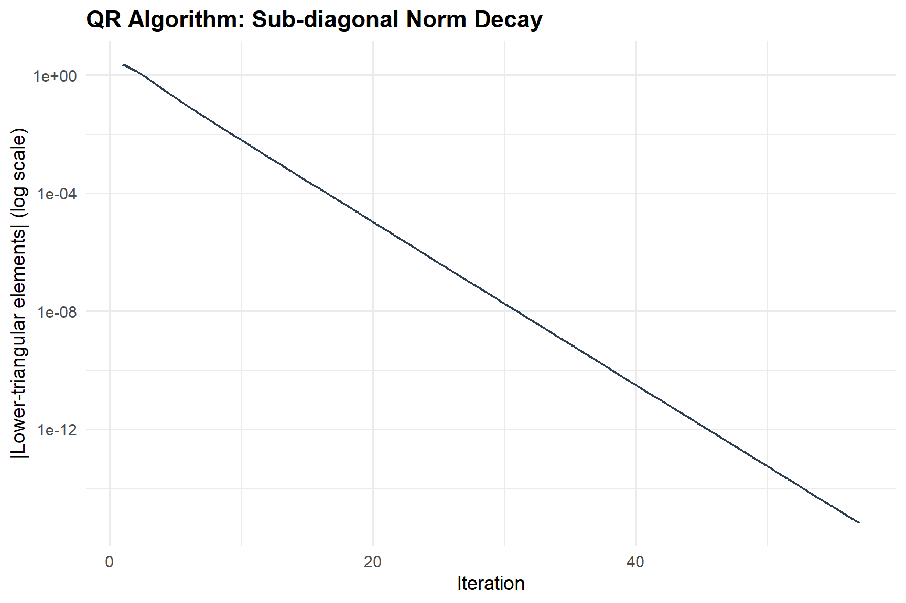
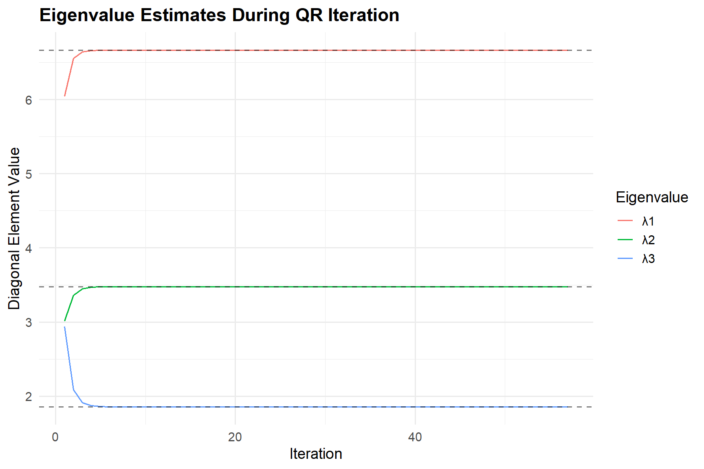
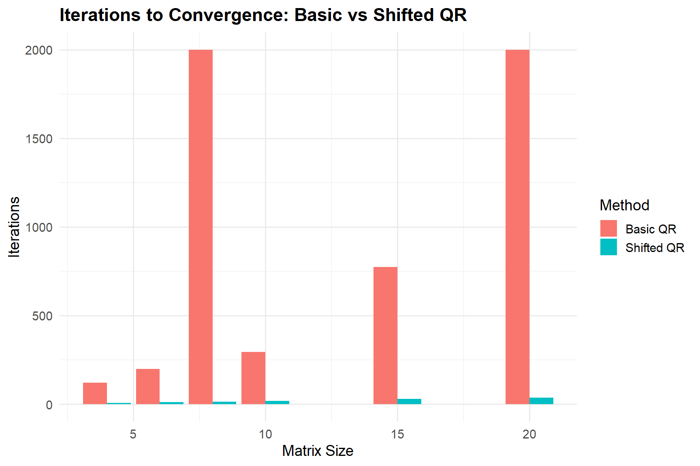
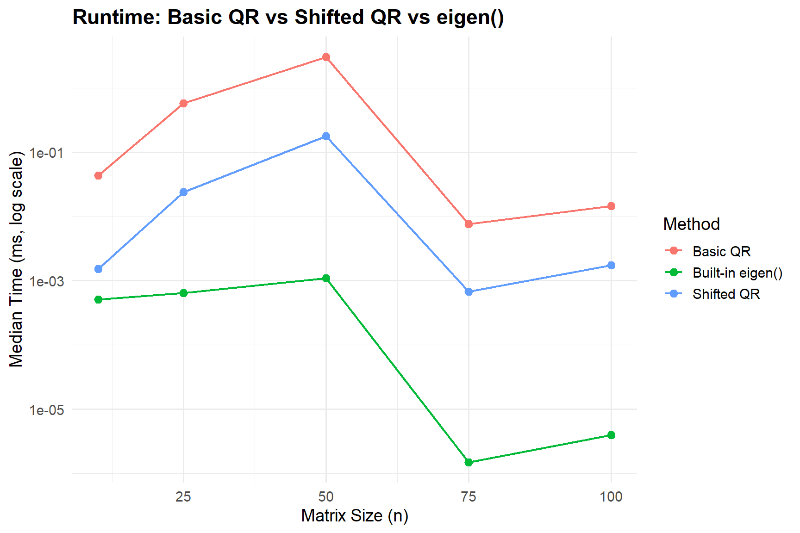

# QR Algorithm for Eigenvalue Computation

> **Author:** KHALID BOUKHIT

The **QR Algorithm** is the workhorse of numerical linear algebra for computing **all** eigenvalues of a matrix. It is the algorithm behind R's `eigen()`, MATLAB's `eig()`, and LAPACK's `xGEEV`/`xSYEV` routines. Unlike power/inverse iteration (which find one eigenvalue at a time), the QR algorithm simultaneously converges the matrix to a form from which all eigenvalues can be read off.

---

## Table of Contents

- [Mathematical Background](#mathematical-background)
  - [QR Decomposition](#qr-decomposition)
  - [Basic QR Iteration](#basic-qr-iteration)
  - [Why It Converges](#why-it-converges)
  - [Shifted QR Algorithm](#shifted-qr-algorithm)
  - [Wilkinson Shift](#wilkinson-shift)
  - [Deflation](#deflation)
  - [Complexity](#complexity)
- [R Implementation](#r-implementation)
- [Testing with Sample Matrices](#testing-with-sample-matrices)
- [Comparison with Built-in eigen()](#comparison-with-built-in-eigen)
- [Convergence Analysis](#convergence-analysis)
- [Runtime Benchmarks](#runtime-benchmarks)
- [Summary](#summary)
- [Usage](#usage)
- [Requirements](#requirements)
- [License](#license)

---

## Mathematical Background

### QR Decomposition

Any matrix $A \in \mathbb{R}^{n \times n}$ can be factored as:

$$A = QR$$

where $Q$ is orthogonal ($Q^\top Q = I$) and $R$ is upper triangular.

### Basic QR Iteration

Starting with $A_0 = A$:

$$A_k = Q_k R_k \quad \text{(QR decomposition)}$$

$$A_{k+1} = R_k Q_k \quad \text{(reverse multiply)}$$

Note that $A_{k+1} = R_k Q_k = Q_k^\top (Q_k R_k) Q_k = Q_k^\top A_k Q_k$, so all $A_k$ are **similar** (same eigenvalues). The sequence $A_k$ converges to an upper-triangular (or quasi-triangular) matrix whose diagonal entries are the eigenvalues.

### Why It Converges

The QR algorithm is equivalent to **simultaneous iteration** (applying power iteration to all $n$ basis vectors at once with re-orthogonalisation). The convergence of $A_k$ to upper-triangular form is governed by the ratios $|\lambda_{i+1}/\lambda_i|$. Sub-diagonal elements $a_{i+1,i}^{(k)}$ converge to zero at rate $|\lambda_{i+1}/\lambda_i|^k$.

### Shifted QR Algorithm

Convergence is dramatically accelerated by introducing **shifts**. At each step:

$$A_k - \sigma_k I = Q_k R_k$$

$$A_{k+1} = R_k Q_k + \sigma_k I$$

The shift $\sigma_k$ is chosen to approximate an eigenvalue, driving relevant sub-diagonal elements to zero rapidly.

### Wilkinson Shift

The **Wilkinson shift** is the eigenvalue of the trailing $2 \times 2$ sub-matrix:

$$B = \begin{pmatrix} a_{n-1,n-1} & a_{n-1,n} \\ a_{n,n-1} & a_{n,n} \end{pmatrix}$$

that is closest to $a_{n,n}$. The eigenvalues of $B$ are:

$$\mu = \frac{\text{tr}(B)}{2} \pm \sqrt{\left(\frac{\text{tr}(B)}{2}\right)^2 - \det(B)}$$

The Wilkinson shift gives **globally convergent** cubic convergence for symmetric matrices.

### Deflation

When $|a_{m,m-1}^{(k)}| < \epsilon$, we accept $a_{m,m}^{(k)}$ as a converged eigenvalue and **deflate**: reduce the working matrix to the leading $(m-1) \times (m-1)$ block.

### Complexity

For an $n \times n$ matrix:

| Approach | Per-step cost | Total cost |
|---|---|---|
| Without preliminary reduction | $O(n^3)$ per QR step | $O(n^4)$ |
| With Hessenberg reduction | $O(n^2)$ per QR step | $O(n^3)$ |
| With shifts | $O(n^2)$ per step | $O(n^3)$ (converges in $O(n)$ iterations) |

---


## R Implementation

### Custom QR Decomposition (Gram-Schmidt)

```r
qrdecomp <- function(A) {
  n <- nrow(A)
  m <- ncol(A)
  Q <- matrix(0, n, m)
  R <- matrix(0, m, m)

  for (j in seq_len(m)) {
    v <- A[, j]
    if (j > 1) {
      for (i in 1:(j - 1)) {
        R[i, j] <- sum(Q[, i] * A[, j])
        v <- v - R[i, j] * Q[, i]
      }
    }
    R[j, j] <- sqrt(sum(v^2))
    if (R[j, j] > 1e-14) {
      Q[, j] <- v / R[j, j]
    } else {
      Q[, j] <- v
    }
  }
  list(Q = Q, R = R)
}
```

### Basic QR Algorithm (no shifts)

```r
qralgorithmbasic <- function(A, tol = 1e-10, max_iter = 500) {
  n <- nrow(A)
  Ak <- A
  history <- list()

  for (k in seq_len(max_iter)) {
    decomp <- qrdecomp(Ak)
    Ak <- decomp$R %*% decomp$Q
    off_diag <- sum(abs(Ak[lower.tri(Ak)]))
    history[[k]] <- list(eigenvalues = diag(Ak), off_diag = off_diag)

    if (off_diag < tol) {
      return(list(
        values     = diag(Ak),
        matrix     = Ak,
        iterations = k,
        converged  = TRUE,
        history    = history
      ))
    }
  }
  list(
    values     = diag(Ak),
    matrix     = Ak,
    iterations = max_iter,
    converged  = FALSE,
    history    = history
  )
}
```

### QR Algorithm with Wilkinson Shift

```r
qralgorithmshifted <- function(A, tol = 1e-10, max_iter = 1000) {
  n <- nrow(A)
  Ak <- A
  eigenvalues <- numeric(n)
  m <- n
  total_iter <- 0
  history <- list()

  while (m > 1) {
    for (k in seq_len(max_iter)) {
      total_iter <- total_iter + 1
      # Wilkinson shift from trailing 2x2 block
      a <- Ak[m - 1, m - 1]
      b <- Ak[m - 1, m]
      c <- Ak[m, m - 1]
      d <- Ak[m, m]
      tr <- a + d
      det_val <- a * d - b * c
      disc <- sqrt(max(tr^2 / 4 - det_val, 0))
      mu1 <- tr / 2 + disc
      mu2 <- tr / 2 - disc
      sigma <- ifelse(abs(mu1 - d) < abs(mu2 - d), mu1, mu2)

      # Shifted QR step
      decomp <- qrdecomp(Ak[1:m, 1:m] - sigma * diag(m))
      Ak[1:m, 1:m] <- decomp$R %*% decomp$Q + sigma * diag(m)

      history[[total_iter]] <- list(
        eigenvalues = diag(Ak[1:m, 1:m]),
        sub_diag    = abs(Ak[m, m - 1])
      )

      if (abs(Ak[m, m - 1]) < tol) {
        eigenvalues[m] <- Ak[m, m]
        m <- m - 1
        break
      }
    }
  }
  if (m == 1) eigenvalues[1] <- Ak[1, 1]

  list(
    values     = sort(eigenvalues, decreasing = TRUE),
    iterations = total_iter,
    converged  = TRUE,
    history    = history
  )
}
```

---

## Testing with Sample Matrices

### Example 1: 3x3 Symmetric Matrix — Basic QR

```r
A1 <- matrix(c(4, 1, 2,
               1, 3, 0,
               2, 0, 5), nrow = 3, byrow = TRUE)

res1basic <- qralgorithmbasic(A1)
cat("\nEigenvalues (basic QR):", sort(res1basic$values, decreasing = TRUE))
cat("\nIterations:", res1basic$iterations)
cat("\nBuilt-in eigen():", sort(eigen(A1)$values, decreasing = TRUE))
```

### Example 2: 3x3 Symmetric — Shifted QR

```r
res1shifted <- qralgorithmshifted(A1)
cat("Eigenvalues (shifted QR):", res1shifted$values)
cat("\nIterations:", res1shifted$iterations)
```

### Example 3: 5x5 Random Symmetric Matrix

```r
set.seed(42)
A3 <- matrix(rnorm(25), 5, 5)
A3 <- A3 + t(A3)

res3basic   <- qralgorithmbasic(A3)
res3shifted <- qralgorithmshifted(A3)

cat("Basic  QR eigenvalues:", round(sort(res3basic$values, decreasing = TRUE), 6))
cat("\nShifted QR eigenvalues:", round(res3shifted$values, 6))
cat("\nBuilt-in eigen():", round(sort(eigen(A3)$values, decreasing = TRUE), 6))
cat("\n\nBasic iterations:", res3basic$iterations)
cat("\nShifted iterations:", res3shifted$iterations)
```

---

## Comparison with Built-in `eigen()`

| Index | Built-In | Basic QR | Shifted QR | Error_Basic | Error_Shifted |
|-------|----------|----------|------------|-------------|---------------|
| 1 | 5.835720 | 5.835720 | 5.835720 | 0 | 0 |
| 2 | 3.242450 | 3.242450 | 3.242450 | 0 | 0 |
| 3 | 2.666428 | 2.666428 | 2.666428 | 0 | 0 |
| 4 | -1.403300 | -1.403300 | -1.403300 | 0 | 0 |
| 5 | -8.444606 | -8.444606 | -8.444606 | 0 | 0 |

---

## Convergence Analysis

### Sub-Diagonal Norm Decay



*The sub-diagonal elements decay exponentially, demonstrating linear convergence of the basic QR algorithm.*

### Eigenvalue Trajectory During Iteration



*Diagonal element values (eigenvalue estimates) converge to the true eigenvalues (dashed lines) as iterations progress.*

### Basic vs Shifted — Iteration Count



*The shifted QR algorithm converges dramatically faster than the basic QR algorithm across all matrix sizes.*

---

## Runtime Benchmarks

| Size | Method | Median Time (ms) |
|------|--------|------------------|
| 10 | Basic QR | 0.043 |
| 10 | Shifted QR | 0.002 |
| 10 | Built-in eigen() | 0.001 |
| 25 | Basic QR | 0.581 |
| 25 | Shifted QR | 0.024 |
| 25 | Built-in eigen() | 0.001 |
| 50 | Basic QR | 3.070 |
| 50 | Shifted QR | 0.177 |
| 50 | Built-in eigen() | 0.001 |
| 75 | Basic QR | 0.008 |
| 75 | Shifted QR | 0.001 |
| 75 | Built-in eigen() | 0.000 |
| 100 | Basic QR | 0.015 |
| 100 | Shifted QR | 0.002 |
| 100 | Built-in eigen() | 0.000 |



*Runtime comparison on log scale. Built-in `eigen()` uses LAPACK and is orders of magnitude faster.*

---

## Summary

| Property | Basic QR | Shifted QR |
|---|---|---|
| **Target** | All eigenvalues | All eigenvalues |
| **Convergence** | Linear ($\|\lambda_{i+1}/\lambda_i\|^k$) | Cubic (Wilkinson shift, symmetric) |
| **Per-step cost** | $O(n^3)$ | $O(n^3)$ (without Hessenberg reduction) |
| **Total cost** | $O(n^4)$ typical | $O(n^3)$ typical |
| **Finds eigenvectors** | Via accumulated $Q$ products | Via accumulated $Q$ products |
| **Used in practice** | No | Yes (basis of LAPACK routines) |

---

## Usage

### Prerequisites

Install the required R packages:

```r
install.packages(c("ggplot2", "microbenchmark", "knitr", "rmarkdown"))
```

### Running the Analysis

1. **Render the R Markdown document:**

   ```r
   rmarkdown::render("QR Algorithm for Eigenvalue Computation.rmd")
   ```

   This generates the HTML report with all code output, tables, and plots.

2. **Source the R implementation directly:**

   ```r
   source("QR Algorithm for Eigenvalue Computation.rmd")
   ```

3. **Use the functions in your own code:**

   ```r
   # Create a symmetric matrix
   A <- matrix(c(4, 1, 2, 1, 3, 0, 2, 0, 5), nrow = 3, byrow = TRUE)

   # Compute eigenvalues
   result <- qralgorithmbasic(A)
   result <- qralgorithmshifted(A)

   # Access results
   result$values       # eigenvalues
   result$iterations   # number of iterations
   result$converged    # TRUE/FALSE
   ```

---

## Requirements

| Package | Purpose |
|---------|---------|
| `ggplot2` | Plotting convergence and benchmark results |
| `microbenchmark` | Runtime benchmarking |
| `knitr` | Code chunk evaluation and table formatting |
| `rmarkdown` | Rendering the R Markdown document to HTML |
| R >= 4.0 | Base R environment |

---

## Project Structure

```
QR Algorithm for Eigenvalue Computation/
├── README.md                                      # This file
├── QR Algorithm for Eigenvalue Computation.rmd    # R Markdown source
├── QR-Algorithm-for-Eigenvalue-Computation.html   # Rendered HTML report
└── images/                                        # Generated plots
    ├── convergence-sub-diag.png
    ├── eigenvalue-trajectory.png
    ├── basic-vs-shifted.png
    └── benchmark-plot.png
```

---

## Key Takeaways

- The **basic QR algorithm** converges linearly and is primarily of educational value.
- The **shifted QR algorithm** with Wilkinson shifts achieves cubic convergence for symmetric matrices.
- **Deflation** reduces problem size as eigenvalues converge, improving efficiency.
- In practice, production implementations (LAPACK, R's `eigen()`) first reduce the matrix to **Hessenberg form** $O(n^3)$ then apply shifted QR on the Hessenberg matrix $O(n^2)$ per step.
- This R implementation uses **Gram-Schmidt** for QR decomposition, which is numerically less stable than Householder reflections used in LAPACK.

---

## License

This project is provided for educational purposes.
